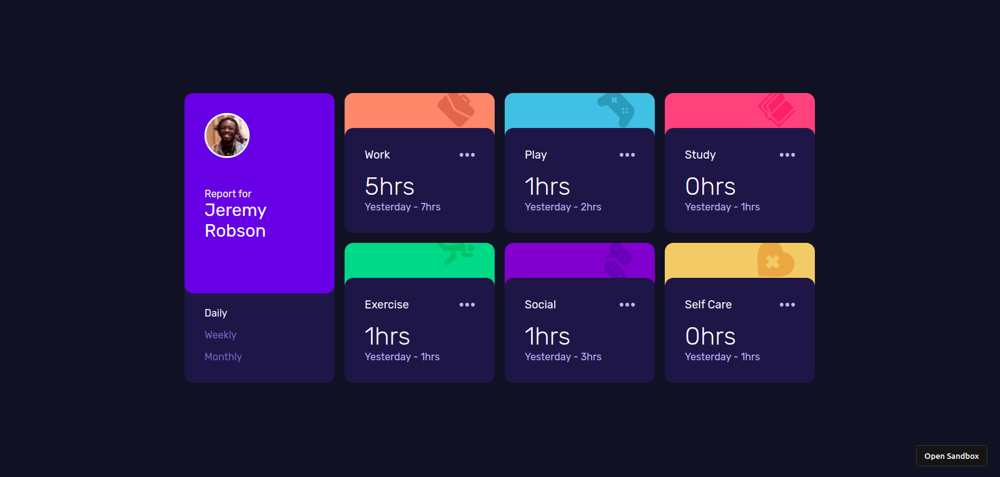
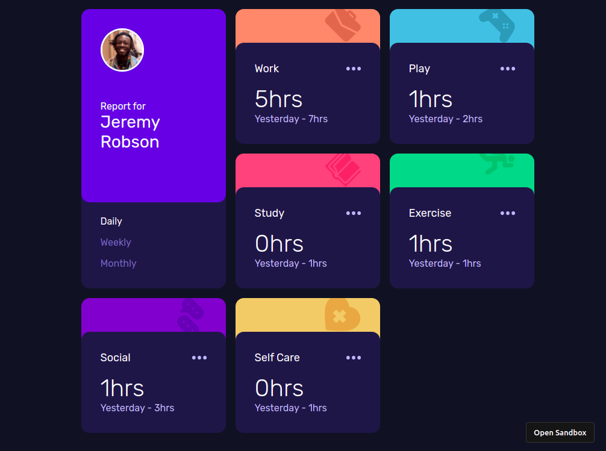
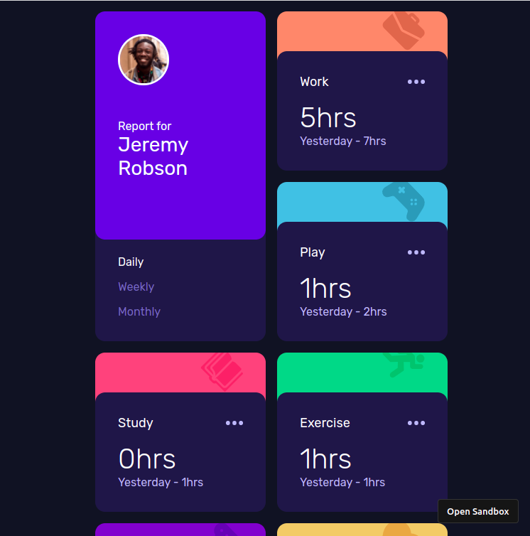
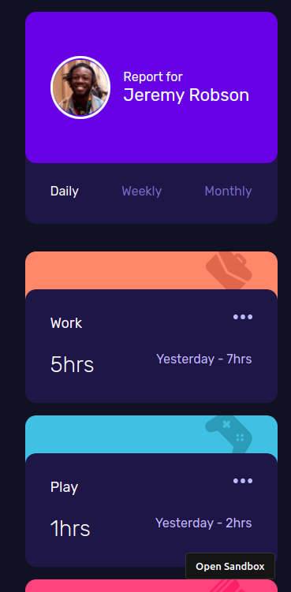

# Frontend Mentor - Time tracking dashboard solution

This is a solution to the [Time tracking dashboard challenge on Frontend Mentor](https://www.frontendmentor.io/challenges/time-tracking-dashboard-UIQ7167Jw). Frontend Mentor challenges help you improve your coding skills by building realistic projects. 

## Table of contents

- [Overview](#overview)
  - [The challenge](#the-challenge)
  - [Screenshot](#screenshot)
  - [Links](#links)
- [My process](#my-process)
  - [Built with](#built-with)
  - [What I learned](#what-i-learned)
  - [Continued development](#continued-development)
  - [Useful resources](#useful-resources)
- [Author](#author)
- [Acknowledgments](#acknowledgments)

**Note: Delete this note and update the table of contents based on what sections you keep.**

## Overview

### The challenge

Users should be able to:

- View the optimal layout for the site depending on their device's screen size
- See hover states for all interactive elements on the page
- Switch between viewing Daily, Weekly, and Monthly stats
- Use URL for routing to the various views

### Screenshot






### Links

- [Live Site](https://ee45qy.csb.app/)


## My process

### Built with

- Semantic HTML5 markup
- Flexbox
- CSS Grid
- Mobile-first workflow
- [React](https://reactjs.org/) - JS library
- [React Router](https://reactrouter.com/) - For routing
- [CSS Modules](https://create-react-app.dev/docs/adding-a-css-modules-stylesheet/) - For styles

### What I learned

Use this section to recap over some of your major learnings while working through this project. Writing these out and providing code samples of areas you want to highlight is a great way to reinforce your own knowledge.
- I learned how to dynamcially importing SVG files into a Component. In previous projects, I added SVG or images directly but in this project, I had to dynamically import images using a dynamic URL.


```html
<h1>Some HTML code I'm proud of</h1>
```
```js
const [icon, setIcon] = useState(null);
  ((name) => {
    import(`../images/icon-${name}.svg`).then((icon) => setIcon(icon.default));
  })(iconName);

  if (icon) {
    return icon;
  } else {
    return "Icon not found";
  }
```
### Continued development

- Add Form to record tasks and hours

### Useful resources

- [Import image dynamically in React component](https://stackoverflow.com/questions/53775936/import-image-dynamically-in-react-component/68178785#68178785) - This helped me to dynamically import the svg icons. I really liked this pattern and will use it going forward.


## Author

- Frontend Mentor - [@joshuaadu](https://www.frontendmentor.io/profile/joshuaadu)
